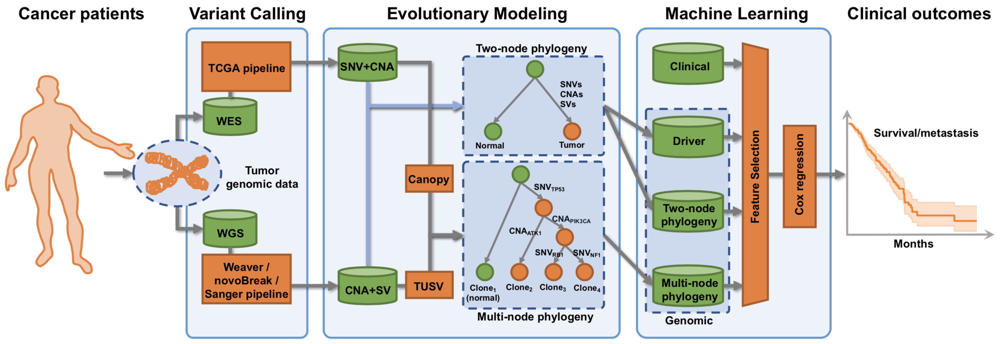

# Improving Personalized Prediction of Cancer Prognoses with Clonal Evolution Models



## Introduction

This repository contains source code for the pipeline in the following paper:
Yifeng Tao, Ashok Rajaraman, Xiaoyue Cui, Ziyi Cui, Jesse Eaton, Hannah Kim, Jian Ma, and Russell Schwartz.
**Improving Personalized Predictiion of Cancer Prognoses with Clonal Evolution Models**. 2019.


## Prerequisites

The code runs on `Python 2.7`.
* Common Python packages are required: `os`, `warnings`, `collections`, `copy`, `math`, `sklearn`, `pickle`, `numpy`, `pandas`.
* Additional Python packages need to be installed as well: `vcf`, `lifelines`.

Depending on the availability of data, external programs for variant calling and evolutionary modeling may be required. Please follow their instructions for installation and running.
* Variant calling (WGS): You may need [Weaver](https://github.com/ma-compbio/Weaver), [novoBreak](https://github.com/czc/nb_distribution),
or [Sanger pipeline](https://github.com/ICGC-TCGA-PanCancer/wdl-pcawg-sanger-cgp-workflow).
Alternatively, the variants called by Sanger pipeline are readily available from [ICGC Data Portal](https://dcc.icgc.org/repositories) with proper license and permission.
* Variant calling (WES): You may need to follow [TCGA pipeline](https://docs.gdc.cancer.gov/Data/Bioinformatics_Pipelines/DNA_Seq_Variant_Calling_Pipeline/#somatic-variant-calling-workflow).
Alternatively, the variants called by TCGA pipeline
are readily available from [GDC Data Portal](https://portal.gdc.cancer.gov/) with proper license and permission.
* Evolutionary modeling (WGS): [TUSV](https://github.com/jaebird123/tusv) is used in the pipeline.
* Evolutionary modeling (WES): [Canopy](https://github.com/yuchaojiang/Canopy) is used in the pipeline.

## Data

The `data/` directory saves the the raw/intermediate/result files.
You need to take care of these directories specifically:
* Clinical data: You may download the [TCGA clinical data](http://firebrowse.org/) of different cancer types,
 and save them as `data/TCGA/[CANCER]/clin.merged.txt`, where `[CANCER]` can be `BRCA`, `LUAD`, and `LUSC` etc.
* Somatic variants (SNVs/CNAs/SVs): Should be saved in the compressed [VCF format](https://samtools.github.io/hts-specs/VCFv4.2.pdf) as `data/vcf-data/[SAMPLE-BARCODE].[variant-caller].[variant].vcf.gz`.
For example, `TCGA-33-4586.sngr.sv.vcf.gz` is the structural variant (SV) file of the sample with the barcode of `TCGA-33-4586` called by the Sanger variant caller pipeline.
* Phylogenies: You may save the TUSV output of the WGS sample with barcode `[SAMPLE-BARCODE]` under `data/tusv/[SAMPLE-BARCODE]/`.
Similarly, save the Canopy output of WES sample with barcode `[SAMPLE-BARCODE]` under `data/canopy/[SAMPLE-BARCODE]/`.

You do not need to organize the following directories, which saves auxiliary files, intermediate files and results.
* List of potential drivers for BRCA (`BRCA_driver.txt`) and LUCA (`lung_driver.txt`),
positions of potential drivers in the genome (`driver_hg19.txt` for GRCh37/hg19, `driver_hg38.txt` for GRCh38/hg38)
have been provided under `data/intogen/`.
* Extracted survival data, clinical/driver/two-node/multi-node features will be saved
under the directories `data/{survival,clinical,driver,twonode,multinode}/`.
* Results will be saved under `data/result/{brca_os,brca_dfs,lung_os,lung_dfs}/` for BRCA/LUCA cancer types and OS/DFS tasks.

## Experiment

Download the repository and create directories:
```
git clone https://github.com/CMUSchwartzLab/cancer-phylogenetics-prognostic-prediction.git
cd cancer-phylogenetics-prognostic-prediction
python create_directories.py
```

Follow [instructions](#prerequisites) of variant caller to call variants, and evolutionary models to build up phylogenies.
Sort, rename, and put them under [proper directories](#data).

The experiment code below implements the feature extraction and maching learning algorithm.
To avoid too many `if-else` branches and redundancies,
the code in this repository specifically focuses on the WGS data,
with somatic variants called by Sanger pipeline,
and phylogenies generated by TUSV model.
However, one should note that the pipeline is flexible,
and is easy to adapt to other variant callers and phylogenetic models
by slightly revising the corresonding modules.

To extract the OS/DFS time and different features from clinical data, somatic variants and cancer phylogenies:
```
python prepare_feature.py
```

To run feature filtering, step-wise feature selection and <em>k</em>-fold cross-validation of Cox regression:
```
python experiment.py
```

## Contributors

The code has been contributed by Yifeng Tao, Ashok Rajaraman, Xiaoyue Cui, Ziyi Cui, Jesse Eaton, and Hannah Kim.

Contact: Yifeng Tao (yifengt@cs.cmu.edu), Russell Schwartz (russells@andrew.cmu.edu)

## License


This work is licensed under a [Creative Commons Attribution-NonCommercial 4.0 International License](https://creativecommons.org/licenses/by-nc/4.0/). You are free to share or adapt the material for non-commercial purposes.


